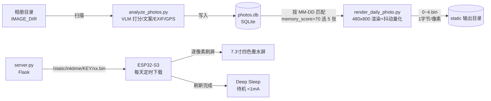

# InkTime 上游实现概览（基线快照）

> 基于 fork 基线 commit `3cdab6c`（2026-07-30），上游仓库 [dai-hongtao/InkTime](https://github.com/dai-hongtao/InkTime)。
> 本文回答「上游现在是什么样」；「我要改成什么样」见 `spec/design/`（待阶段 1 产出）。

## 一句话

墨水屏「回忆相框」：VLM 给相册照片打分、写文案 → 每天从「历史上的今天」选片，渲染四色墨水屏图 → ESP32 拉取显示后深度休眠。

## 数据流

## 组件明细

### 1. 照片分析：analyze_photos.py

- 扫描相册 → 每张照片两次 VLM 调用：评分（memory_score / beauty_score）+ 一句话文案
- EXIF / GPS 提取，GPS 转城市名（GeoNames 离线索引 `data/world_cities_zh.csv`）
- 结果存 SQLite `photos.db`（photo_scores 表）
- 工程化能力：多渠道 failover、并发（`-j N`）、断点续跑、NAS 重挂载、HEIF 支持
- 提示词在脚本内，可自行调整评分标准与文案风格

### 2. 日常渲染：render_daily_photo.py

- 选片规则：当天 MM-DD 匹配 + memory>70 随机选 5 张；当天无照片则回溯最多 365 天；再无则全局最高分兜底
- 渲染 480×800（底部 100px：文案 + 日期 + 城市）
- Floyd-Steinberg 抖动量化为黑/白/红/黄四色，导出 `0~4.bin`（1 字节/像素，5 张图循环）
- 另有 13.3 寸变体 `render_daily_photo_133c.py`

### 3. 下载服务：server.py

- Flask；静态路径 `/static/inktime/<DOWNLOAD_KEY>/photo_N.bin` 供 ESP32 下载（KEY 是简单口令，非加密）
- `/review` WebUI：浏览打分结果、预览模拟墨水屏渲染效果（跑通后建议关闭）
- 部署形态：`scripts/daily_render.sh` 由 cron 每日触发渲染；`server.py` 用 systemd 常驻

### 4. ESP32 固件：esp32/ink-display-7C-photo/*.ino

- 硬件：ESP32-S3-N8R8（需 PSRAM ≥ 384K）+ 7.3 寸四色屏 EL073TS3（49-pin），GxEPD2 库驱动（GxEPD2_730c_GDEY073D46）
- 流程：NVS 读配置（无则 AP 配网 `InkTime-xxxx` / 密码 12345678）→ NTP 校时 → 随机下载一张 bin 到 PSRAM → 逐像素刷屏 → 深睡到配置的 refresh_hour
- 按键：SW1=RESET 强刷一次并可作为长休眠唤醒；SW2+SW1=清空 NVS 恢复出厂（重新配网）
- 下载超时（60s）也进长休眠，避免异常耗电
- 引脚：BUSY=14, RST=13, DC=12, CS=11, SCLK=10, DIN=9（SPI）
- 另有 13.3 寸版固件 `esp32/ink-display-133C-photo/`

### 5. PCB：esp32/pcb/

- 完整资产：`Schematic.pdf`（原理图）、`BOM.csv`、`Gerber/`、`PickAndPlace.xlsx`、`InkTime_JLC_EDA.zip`（嘉立创 EDA 工程）→ 可直接发打板厂
- 关键焊盘：H1=UART 串口（建议烧录口）、H2=USB、H3=BOOT（烧录时短接 GND 后上电）、H4=接墨水屏转接板、H5=3.7V 电池、H6=5V 测试
- R2/R3/C5/C6 供 USB，可留空不焊；SW3/SW4 备用 GPIO 可留空
- 注意：PCB 上是 ESP32-S3 模组，需要 SMT 贴片（可让打板厂贴，或选成品板路线绕开）

### 6. 上游作者的参考配置

- VLM：LM Studio 本地跑 qwen3-vl-30b（文案质量不错的最低档）
- 续航：2 节 18650（5000mAh）约半年一充

## 关键文件地图

| 路径 | 作用 |
|---|---|
| `analyze_photos.py` | 照片分析入口（评分/文案/入库） |
| `render_daily_photo.py` | 每日选片与墨水屏渲染 |
| `render_daily_photo_133c.py` | 13.3 寸版渲染 |
| `server.py` | 下载服务 + WebUI（大文件，含较多逻辑） |
| `config-example.py` | 配置模板（IMAGE_DIR / API_CHANNELS / DOWNLOAD_KEY） |
| `scripts/daily_render.sh` | cron 每日渲染脚本 |
| `esp32/ink-display-7C-photo/` | 7.3 寸 ESP32 固件（Arduino） |
| `esp32/ink-display-133C-photo/` | 13.3 寸 ESP32 固件 |
| `esp32/pcb/` | 原理图 / BOM / Gerber / EDA 工程 |
| `data/world_cities_zh.csv` | GeoNames 离线城市索引 |
| `requirements.txt` | Python 依赖 |
